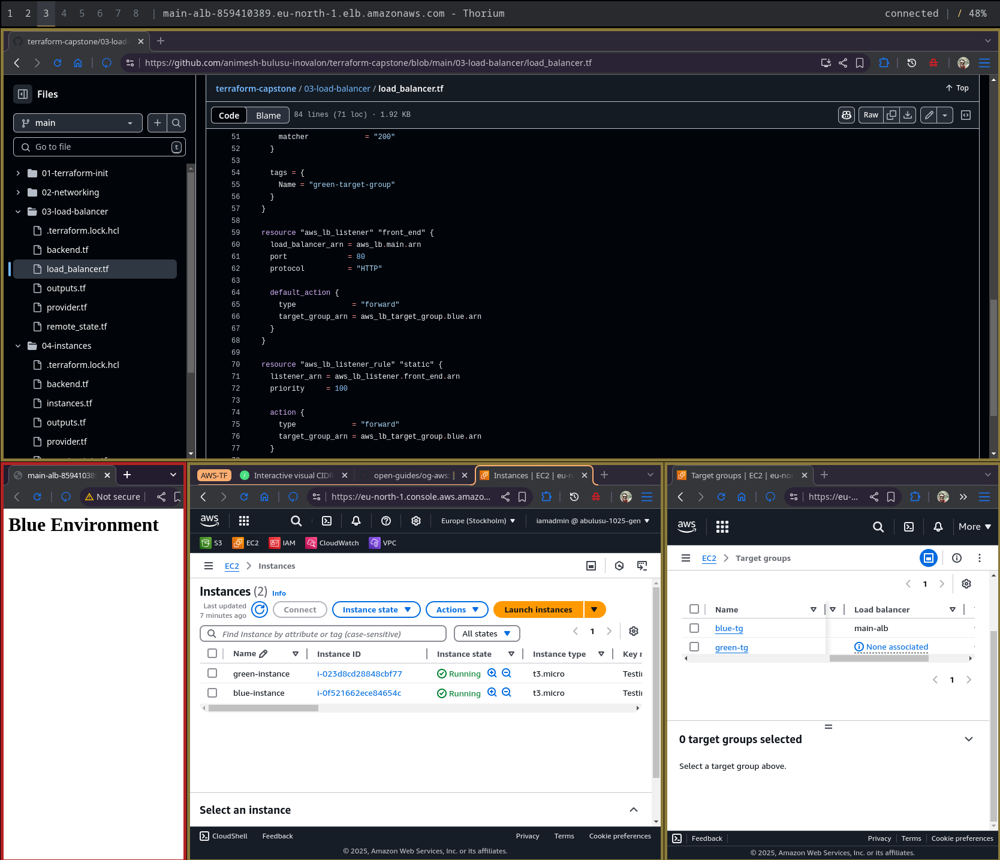
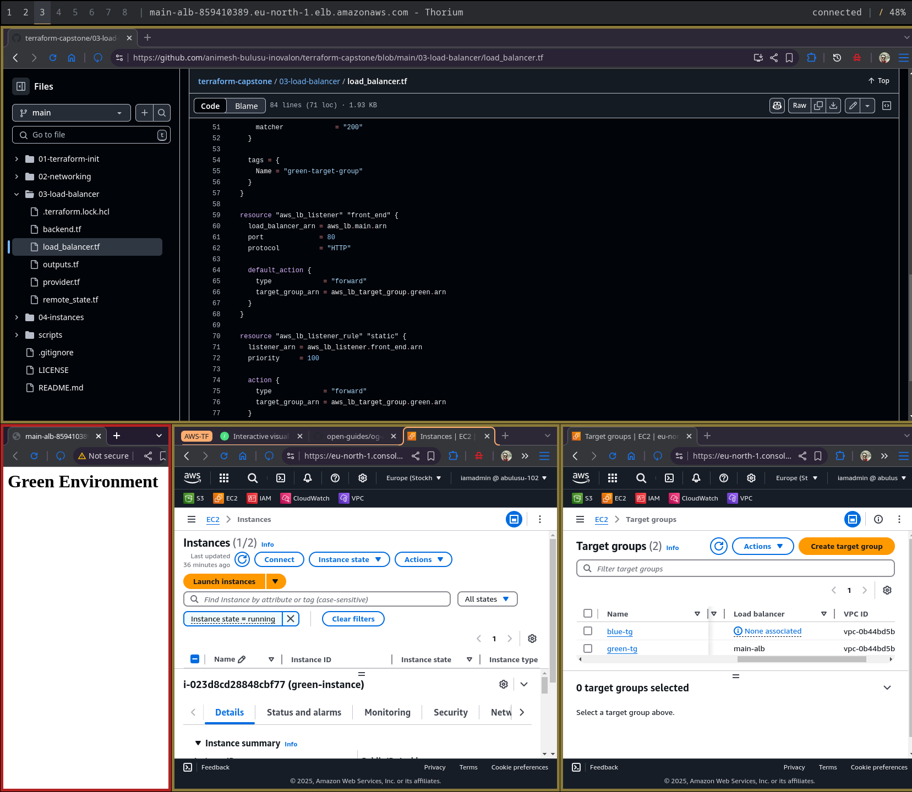

# Terraform Capstone Project

## Goal

Perform Blue-Green Zero-Downtime Deployment using Terraform with a load balancer and two virtual machines (VMs), enabling manual switchover with zero impact on users.

## Technologies Used

AWS EC2, AWS ELB, Terraform, Github Actions

## Layers

1. Terraform Initialization
2. Networking
    1. VPC
    2. Subnets
    3. Security Groups
    4. Internet Gateway
    4. Route Tables
3. Load Balancer
4. EC2 Instances

## Manual Cutover Mechanism

To achieve a manual cutover, change the `target_group_arn` to the green instance in the load balancer listener resource.

```
resource "aws_lb_listener" "front_end" {
  ...

  default_action {
    type             = "forward"
    target_group_arn = aws_lb_target_group.green.arn
  }
}

resource "aws_lb_listener_rule" "static" {
  ...

  action {
    type             = "forward"
    target_group_arn = aws_lb_target_group.green.arn
  }
}
```

**Before cutover, blue instance is in use.**



**After cutover, green instance is in use.**



